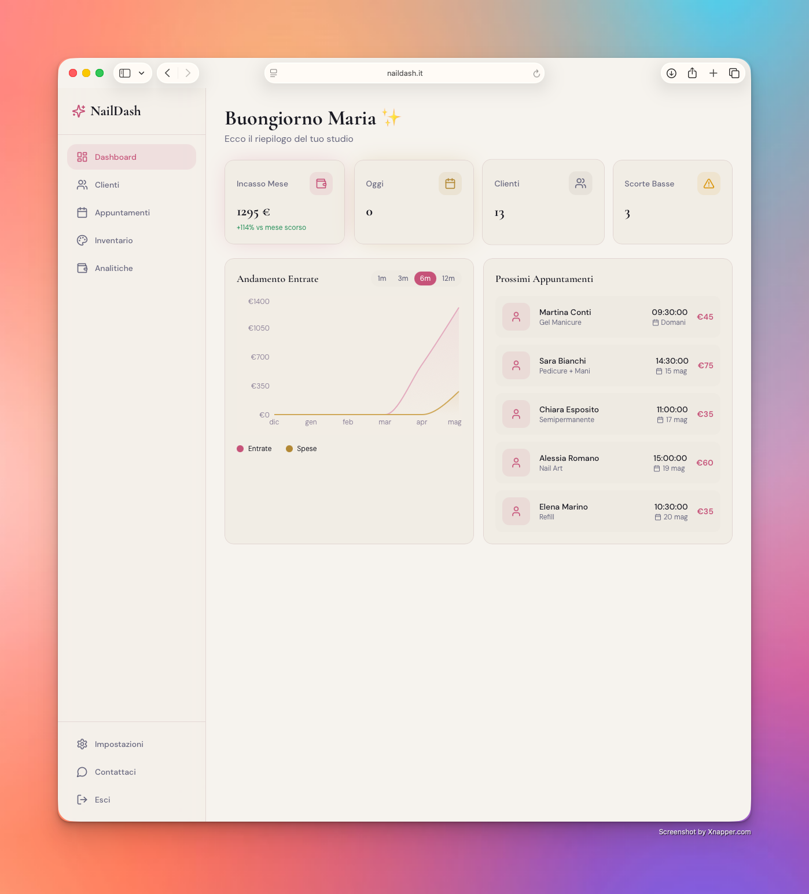
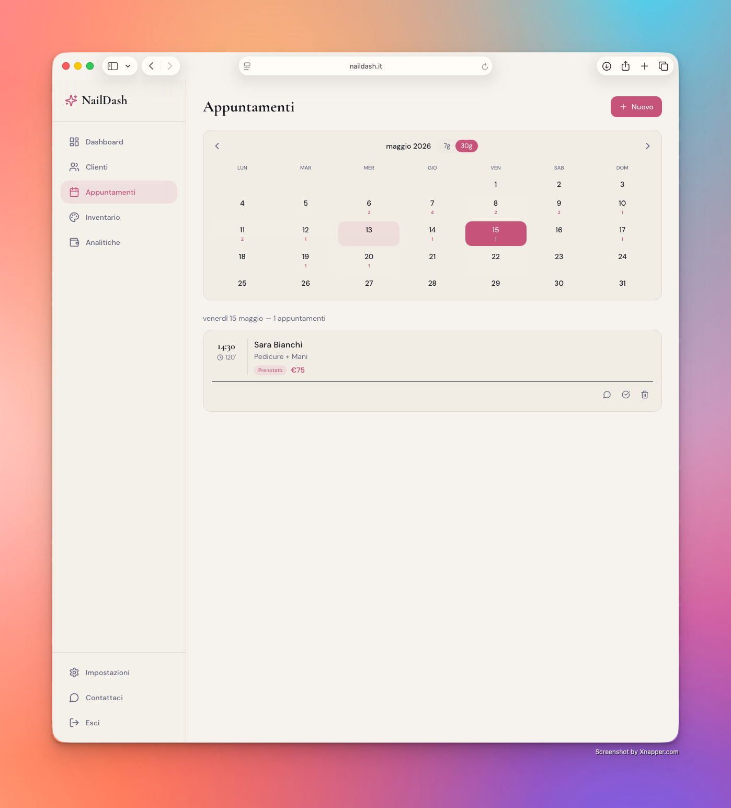
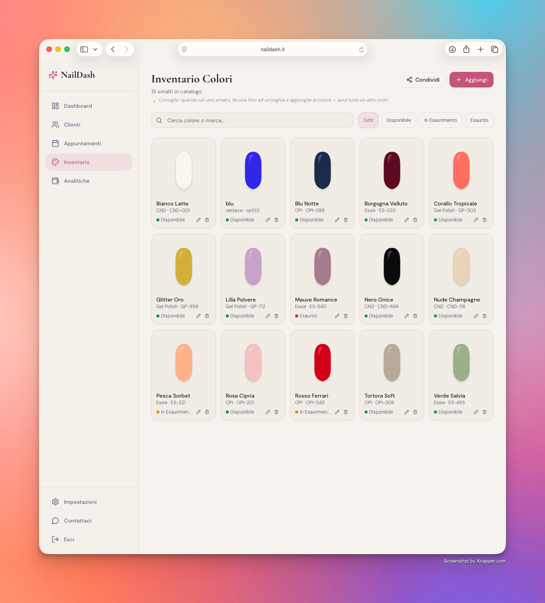
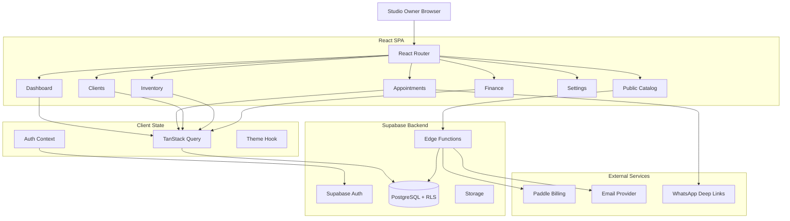
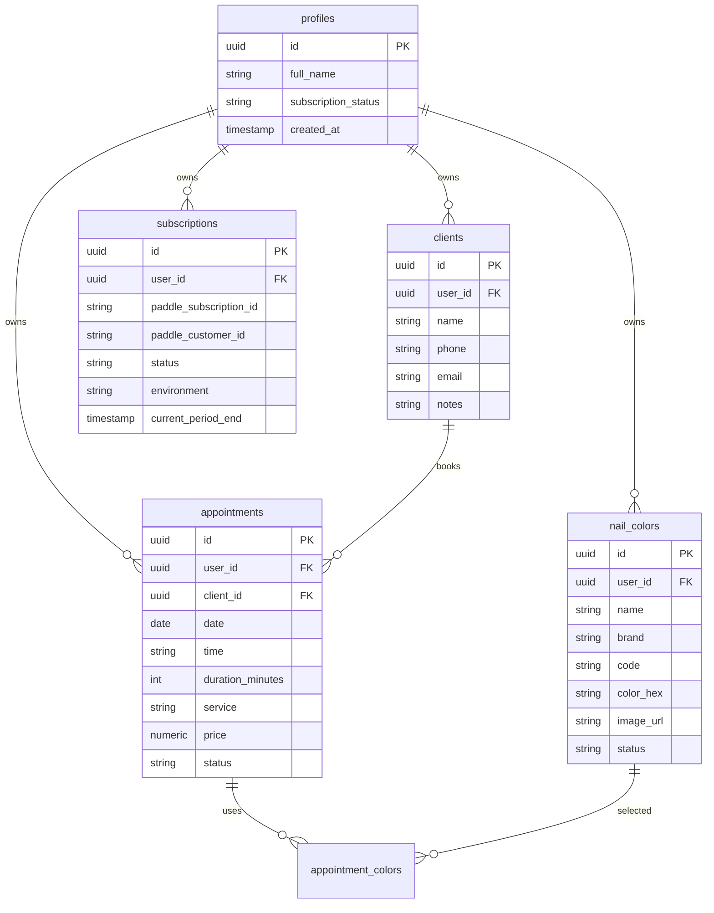

# NailDash — Case Study

> SaaS dashboard for nail artists and beauty studios: appointment scheduling, client CRM, inventory tracking, revenue analytics, public color catalog, subscription billing, and automated email workflows.

[](https://www.typescriptlang.org/)
[](https://react.dev/)
[](https://vitejs.dev/)
[](https://supabase.com/)
[](https://www.paddle.com/)
[](https://playwright.dev/)
## 🏗️ NailDash — SaaS Platform

**Live Production App:** [https://naildash.it](https://naildash.it)  
**Status:** 🚀 Active | Serving real-world beauty studios

## Overview

NailDash is a production-oriented SaaS platform for independent nail technicians and beauty studios. It centralizes the operational workflow of a studio: appointments, client records, stock/inventory, financial tracking, public catalog sharing, onboarding, subscription billing, and support.

The original repository is private because it contains active product code, Supabase configuration, billing flows, and business logic. This public repository documents the architecture and technical decisions without exposing proprietary source code.

## Product Scope

| Area | Problem | Product Solution |
|---|---|---|
| Scheduling | Nail artists manage appointments manually across chats, calendars, and notebooks. | Calendar views, appointment CRUD, completion workflow, WhatsApp presets, client linking. |
| Client CRM | Customer history and notes are scattered. | Client database with contact data, notes, appointment relationship, import workflow. |
| Inventory | Colors and nail products are difficult to track. | Nail color inventory, stock states, public catalog page, low-stock indicators. |
| Revenue | Small studios lack clear visibility into monthly performance. | KPI dashboard, revenue chart, monthly comparisons, finance entries. |
| Monetization | SaaS needs trials, subscriptions, and customer portal flows. | Paddle checkout, webhook sync, subscription status banners, trial countdown. |
| Onboarding | New users need guidance to configure the studio quickly. | Interactive onboarding tutorial, email verification prompts, profile setup. |

## Screenshots

| Dashboard | Appointments | Inventory |
|---|---|---|
|  |  |  |

## Architecture



## Tech Stack

| Layer | Technology | Why it fits |
|---|---|---|
| Frontend | React 18, TypeScript, Vite | Fast SPA delivery, strict types, excellent DX. |
| Routing | React Router | Clear page-level separation for SaaS dashboard flows. |
| UI System | Tailwind CSS, shadcn/ui, Radix primitives | Accessible components with full styling control. |
| Server State | TanStack React Query | Caching, invalidation, optimistic workflows. |
| Backend | Supabase | Auth, Postgres, RLS, Edge Functions, generated types. |
| Database | PostgreSQL + Supabase migrations | Relational model with row-level tenant isolation. |
| Billing | Paddle | Checkout, customer portal, subscription webhooks. |
| Testing | Vitest, Testing Library, Playwright | Unit/component coverage plus real browser E2E testing. |
| Emails | Supabase auth hooks + email queue functions | Custom transactional email flow. |
| Design | Custom Tailwind theme | Beauty-industry visual identity, responsive dashboard UI. |

## Key Features

### Dashboard and Analytics

- Monthly revenue KPI with comparison against previous month.
- Daily appointment count.
- Client count.
- Low-stock inventory indicator.
- Revenue chart powered by finance data.
- Upcoming appointments widget.
- Contextual greeting using profile data.

### Appointment Management

- 7-day and 30-day calendar modes.
- Appointment creation with client selection or inline client creation.
- Service presets for nail workflows: gel, semipermanent, manicure, pedicure, refill, nail art, removal, reconstruction.
- Appointment completion workflow.
- Automatic overdue prompt for appointments that remain scheduled more than two hours after their time slot.
- WhatsApp preset integration for client messaging.

### Client CRM

- Client records with name, phone, email, and notes.
- Appointment relationships through Supabase foreign keys.
- Import dialog for client migration.
- Search and filtering UX for fast appointment creation.

### Inventory and Public Catalog

- Nail color inventory with name, brand, code, color hex, image URL, and stock status.
- Public catalog route for sharing available colors with customers.
- Edge Function that exposes public color data safely.
- Low-stock status badges.

### Billing and Subscription Lifecycle

- Paddle checkout integration.
- Customer portal flow.
- Webhook function for subscription created, updated, canceled, and failed payment events.
- Subscription status synchronization with user profiles.
- Trial countdown and subscription status banners.
- Test mode banner for billing workflows.

### Authentication and Onboarding

- Supabase Auth integration.
- Protected route wrapper.
- Email verification banner.
- Forgot/reset password flows.
- Interactive onboarding tutorial.
- Custom auth email hooks and templates.

### Support and Communications

- Support dialog.
- Supabase Edge Function for support email.
- Email queue processor.
- WhatsApp deep-link helper for customer messages.

## Database Model



## Supabase Edge Functions

| Function | Purpose |
|---|---|
| `payments-webhook` | Verifies Paddle events and synchronizes subscription rows/profile status. |
| `customer-portal` | Creates customer portal sessions. |
| `get-paddle-price` | Resolves plan/price configuration for checkout. |
| `cancel-subscription` | Schedules or executes cancellation flow. |
| `resume-subscription` | Resumes a canceled subscription where supported. |
| `get-public-colors` | Public read endpoint for a studio's color catalog. |
| `send-support-email` | Sends support requests. |
| `process-email-queue` | Handles queued transactional emails. |
| `auth-email-hook` | Customizes Supabase Auth email delivery. |

## Implementation Highlights

### Multi-Tenant Data Isolation

The app is built around a user-owned data model. Core tables include `user_id` and are accessed through Supabase-generated types and row-level security policies. This is essential for SaaS: each studio owner sees only their own clients, appointments, inventory, and subscription state.

### Subscription State Sync

The Paddle webhook function handles subscription lifecycle events and writes normalized subscription data into Supabase. It also keeps a legacy/profile-level subscription status in sync so older UI paths remain compatible while the billing system evolves.

### Paddle Webhook Signature Verification

Payment webhooks are treated as untrusted input until Paddle's signature is verified. The Edge Function reads the raw request body, checks the `Paddle-Signature` header, selects the correct webhook secret for the current environment (`sandbox` or `production`), and fails closed before touching subscription data.

```ts
async function handleWebhook(req: Request, env: PaddleEnv) {
  const signature = req.headers.get("Paddle-Signature");
  if (!signature) {
    return new Response("Missing webhook signature", { status: 400 });
  }

  const rawBody = await req.text();
  const webhookSecret = env === "production"
    ? Deno.env.get("PADDLE_WEBHOOK_SECRET_PROD")
    : Deno.env.get("PADDLE_WEBHOOK_SECRET_SANDBOX");

  if (!webhookSecret) {
    return new Response("Webhook secret not configured", { status: 500 });
  }

  const event = await verifyPaddleSignature({
    rawBody,
    signature,
    webhookSecret,
  });

  await syncSubscriptionEvent(event, env);
  return new Response(JSON.stringify({ received: true }), { status: 200 });
}
```

The important detail is preserving the raw payload before JSON parsing. Signature verification must happen first; otherwise an attacker could forge subscription status changes or activate paid features without a valid Paddle event.

### Appointment Completion Workflow

Appointments are not just calendar items. They drive finance/revenue reporting, client history, and inventory color usage. The UI includes overdue appointment prompts to help studio owners complete records and keep analytics accurate.

### Public Catalog Sharing

The public catalog route allows a nail artist to share available colors without exposing the admin dashboard. The public data is served through an Edge Function, keeping the frontend simple while controlling data exposure.

### Billing UX

Billing is surfaced directly in the app through trial countdown, subscription status, upgrade pages, customer portal, and test mode banner. This makes subscription state visible to the user and easier to debug during development.

## Testing Strategy

The private codebase includes:

- Vitest setup for unit/component testing;
- Testing Library configuration;
- Playwright configuration for browser-level E2E flows;
- basic example tests;
- scripts for `test` and `test:watch`.

Recommended production test expansion:

- appointment creation/edit/delete E2E;
- Paddle checkout mock flow;
- webhook signature verification tests;
- public catalog access tests;
- RLS policy tests for cross-user access denial;
- email queue processing tests.

## Engineering Decisions

### Why Supabase instead of a custom backend?

The product needs authentication, database, RLS, migrations, generated types, and serverless functions. Supabase provides these primitives quickly while still allowing PostgreSQL-level control. For a small SaaS team, this is a strong velocity/security tradeoff.

### Why Paddle for billing?

Paddle acts as merchant of record, reducing the operational burden around VAT, invoicing, and global subscription billing. The webhook approach keeps subscription truth in the backend while the UI can react to local subscription rows.

### Why React Query?

The app has many server-state surfaces: appointments, clients, finance entries, inventory, profile, and subscriptions. React Query provides cache invalidation and loading/error states without manually building global stores for each resource.

### Why public catalog as a dedicated route?

Studios can share available colors directly with clients. This creates a customer-facing feature while protecting private admin data and avoids requiring clients to log in.

## Roadmap

- Harden RLS test coverage for all tenant-owned tables.
- Add stronger analytics: retention, average ticket, service mix, client frequency.
- Add SMS/WhatsApp reminders for appointments.
- Add calendar integrations with Google Calendar.
- Add inventory usage tracking by completed appointment.
- Add automated low-stock reorder suggestions.
- Expand Playwright coverage around billing and onboarding.
- Add observability for Edge Functions and failed email jobs.
- Add an admin-facing audit log for sensitive changes.

## What This Demonstrates

This project demonstrates practical SaaS engineering:

- multi-tenant data modeling;
- Supabase Auth and RLS-based backend design;
- subscription billing with real webhook handling;
- React dashboard architecture with typed data access;
- domain-specific appointment and inventory workflows;
- public/private data boundaries;
- production-minded onboarding, support, and email infrastructure.

## Repository Note

This is a public case study. The production source code remains private because it belongs to an active SaaS product implementation.

## Author

**AJ Subrizi**  
GitHub: [@AJSubrizi](https://github.com/AJSubrizi)
