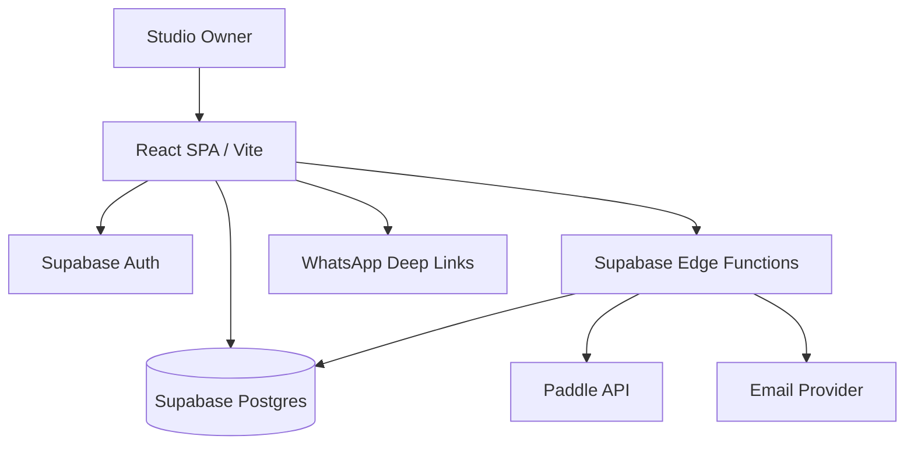
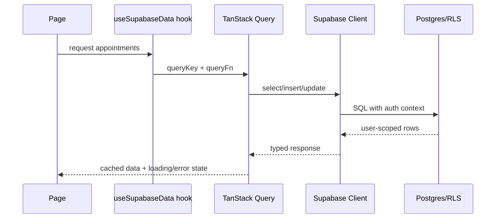
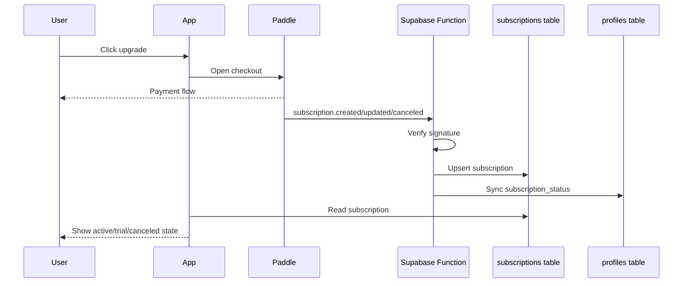

# Architecture Deep Dive

This document describes the NailDash architecture and the reasoning behind its main technical choices.

## 1. System Context

NailDash is a vertical SaaS product for nail artists and beauty studios. Its core value is operational consolidation: appointments, clients, color inventory, finance, subscription status, and support live in one dashboard.

## 2. Runtime Architecture

The frontend is a Vite-built React SPA. Supabase provides backend primitives: auth, database, row-level security, generated types, migrations, and Edge Functions.

## 3. Frontend Domains

The app is separated into page-level domains:

- `Dashboard`: KPI summary and revenue chart;
- `Appointments`: calendar, scheduling, completion flow;
- `Clients`: customer CRM;
- `Inventory`: nail colors and product stock;
- `Finance`: revenue and finance entries;
- `Settings`: account/studio configuration;
- `PublicCatalog`: customer-facing color catalog;
- `Upgrade`: subscription purchase flow;
- `Support`: customer support entrypoint;
- auth pages: login, register, reset, verify email.

## 4. Data Access Pattern

React Query is used for server-state orchestration. Custom hooks wrap Supabase calls and provide a consistent interface for pages.

Typical flow:

## 5. Multi-Tenant Isolation

Most business tables include `user_id`. Supabase RLS policies enforce ownership at the database level, not only in UI code.

This pattern protects against:

- accidental cross-user reads;
- malicious client-side query manipulation;
- missing frontend filters;
- future route/API expansion mistakes.

## 6. Billing Architecture

Paddle handles checkout and subscription lifecycle. Supabase Edge Functions receive webhooks and sync the subscription state into Postgres.

## 7. Email and Support Infrastructure

The Supabase function layer contains custom email templates and queue processing. This supports auth emails, recovery flows, support requests, and other transactional email use cases.

Key benefits:

- branding control over auth emails;
- async processing for support messages;
- centralized provider integration;
- extensibility for onboarding and lifecycle emails.

## 8. Public Catalog Boundary

The public catalog is intentionally separate from the authenticated dashboard. Customers can view available nail colors through a public URL, but cannot access client records, appointments, finance, or admin settings.

The Edge Function is the boundary that decides which color data is safe to expose.

## 9. UI System

The app uses shadcn/ui and Radix primitives to maintain accessibility and design consistency across many dashboard pages.

Benefits:

- keyboard-accessible primitives;
- consistent dialogs, dropdowns, popovers, sheets, tabs, cards;
- local ownership of component code;
- easy customization for a beauty-focused visual brand.

## 10. Operational Concerns

Important operational surfaces:

- subscription status drift between Paddle and local DB;
- webhook failure handling;
- email queue monitoring;
- RLS policy correctness;
- appointment completion accuracy;
- inventory stock status;
- onboarding completion rates.

## 11. Future Architecture Improvements

- Add a dedicated audit log table for sensitive changes.
- Move WhatsApp reminders from deep links to scheduled messaging where compliant.
- Add server-side analytics materialized views for dashboard KPIs.
- Add automated regression tests for RLS policies.
- Add webhook replay tooling for billing failures.
- Add feature flags for paid-plan capabilities.
