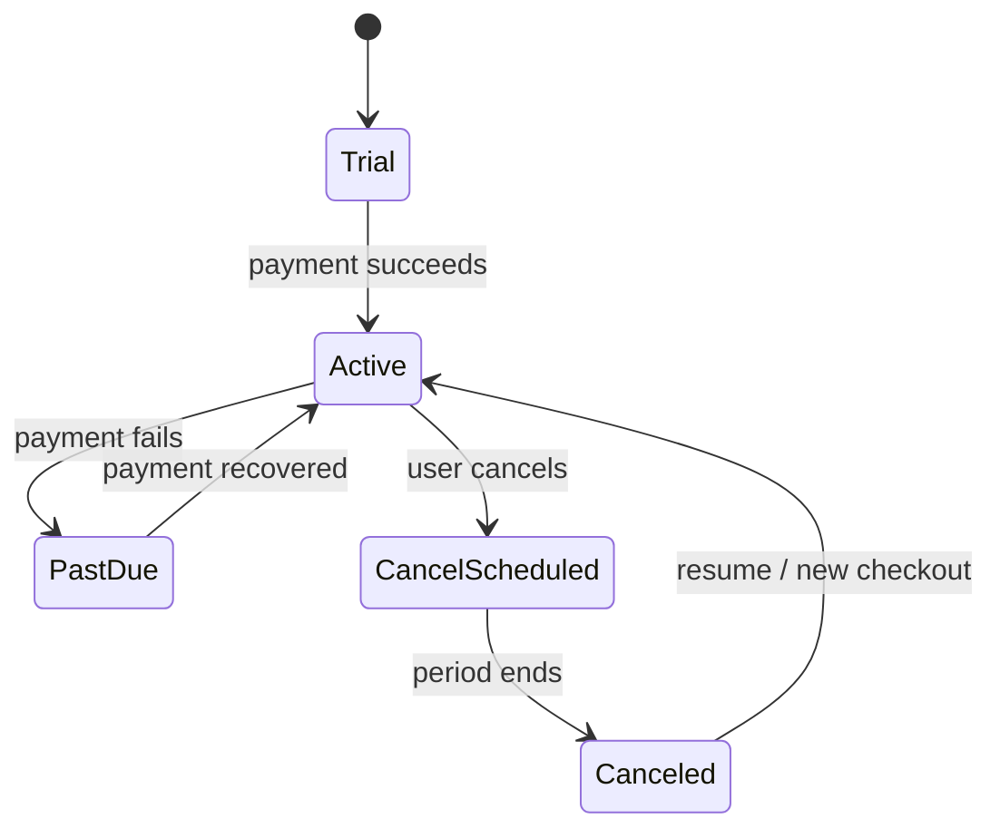

# Billing and Subscription Lifecycle

NailDash uses Paddle for subscription billing and Supabase Edge Functions for webhook handling.

## Why Paddle

Paddle is a strong fit for a small SaaS product because it can act as merchant of record. This reduces complexity around tax/VAT handling, invoicing, and international subscription operations.

## Lifecycle

## Webhook Handling

The billing webhook function handles subscription lifecycle events:

- subscription created;
- subscription updated;
- subscription canceled;
- failed payment event logging.

The function verifies Paddle events, extracts `userId` from custom data, upserts subscription rows, and synchronizes profile-level subscription status.

## Local Data Model

The subscription row stores:

- Supabase user ID;
- Paddle subscription ID;
- Paddle customer ID;
- product ID;
- price ID;
- status;
- environment (`sandbox`/`production`);
- current billing period start/end;
- cancellation flag;
- timestamps.

This gives the frontend a local, queryable source of truth instead of calling Paddle directly on every render.

## UI Integration

The subscription layer appears in the product UI through:

- trial countdown banner;
- subscription status banner;
- upgrade page;
- upgrade success page;
- customer portal hook;
- payment test mode banner.

## Engineering Notes

- Webhook idempotency should be enforced at the event level in future versions.
- Failed payment events should eventually trigger a user-facing email workflow.
- Feature access should be centralized in a plan entitlement helper.
- Sandbox/production environments must remain isolated in database queries.
