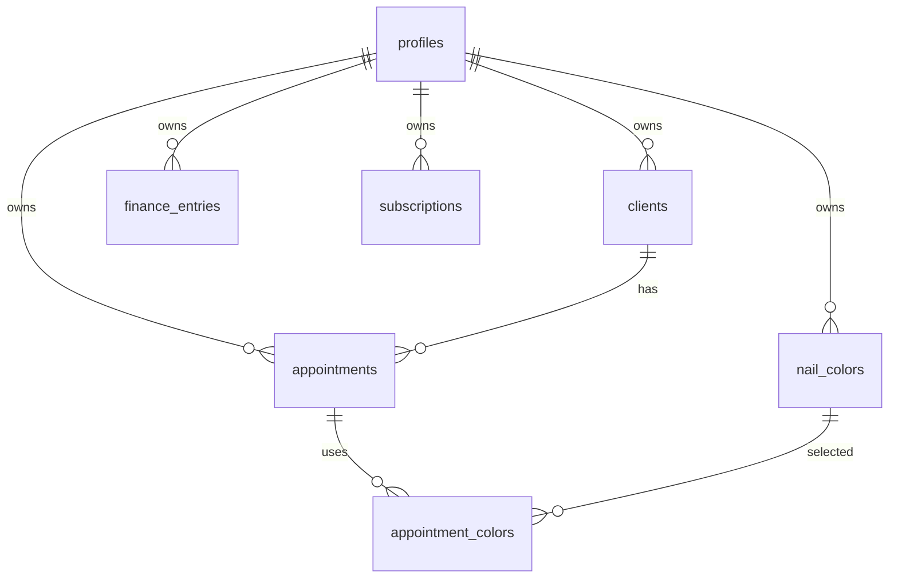

# Data Model

The NailDash data model is built around the SaaS tenant: each studio owner has their own clients, appointments, colors, finance records, profile, and subscription.

## Core Entities

## Profiles

Stores user/studio-level metadata and subscription status. The profile is the anchor for onboarding, billing visibility, and studio personalization.

## Clients

Stores customer information for a studio:

- name;
- phone;
- email;
- notes;
- owner user ID.

## Appointments

Stores scheduled or completed services:

- linked client;
- date/time;
- duration;
- service name;
- price;
- notes;
- status.

The appointment table powers both the calendar UX and dashboard KPIs.

## Nail Colors

Stores inventory/catalog data:

- color name;
- brand;
- code;
- color hex;
- image URL;
- stock status.

## Appointment Colors

Join table connecting completed appointments to colors used. This enables future analytics such as most-used colors and reorder suggestions.

## Subscriptions

Stores Paddle subscription state locally so the app can render entitlement and subscription status without calling Paddle on each page load.

## RLS Strategy

Every tenant-owned table should enforce policies based on `auth.uid() = user_id` or equivalent ownership mapping.

The public catalog is the exception: it exposes only intentionally public color information through a dedicated Edge Function.

## Future Data Improvements

- Add audit logs for admin-sensitive operations.
- Add materialized views for dashboard summary queries.
- Add appointment reminder logs.
- Add webhook event table for Paddle idempotency.
- Add imports table for client CSV import tracking.
